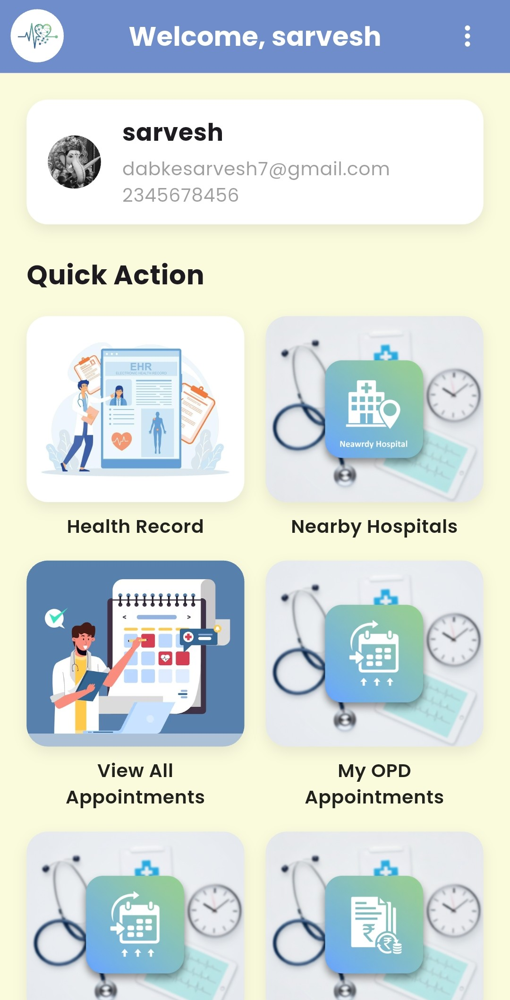
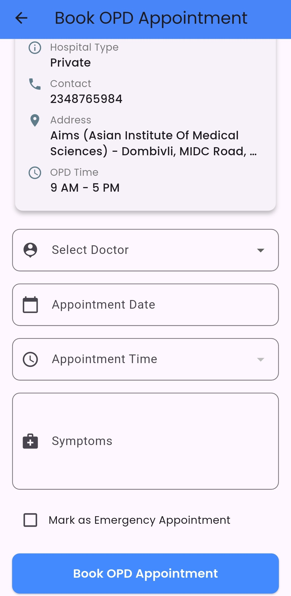
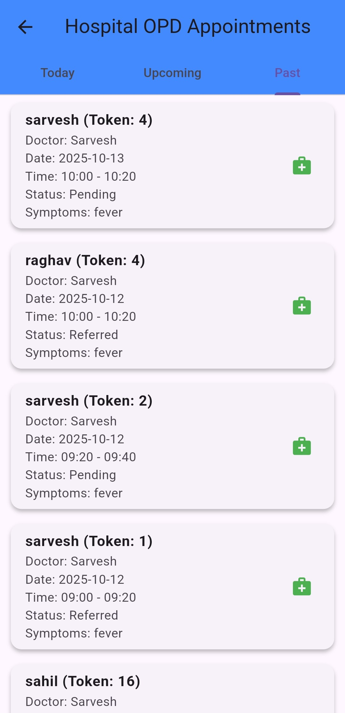
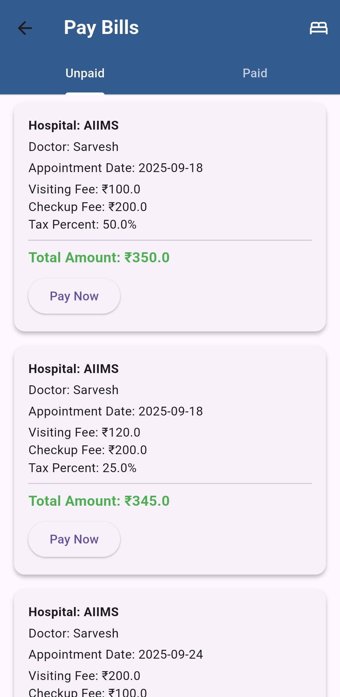
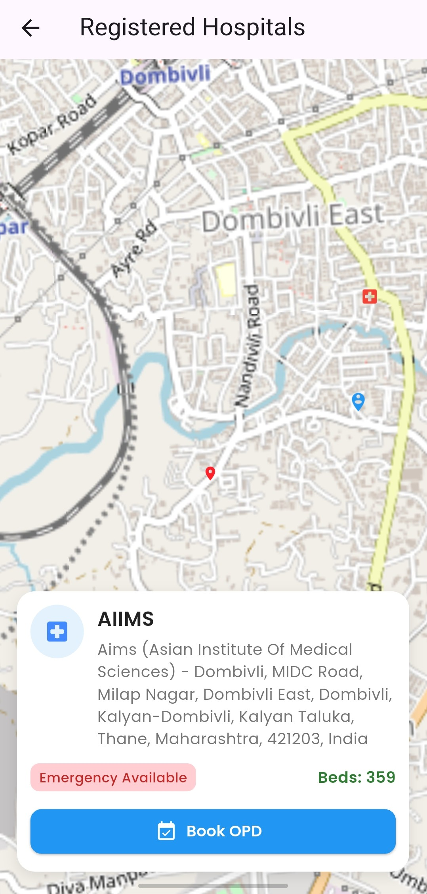
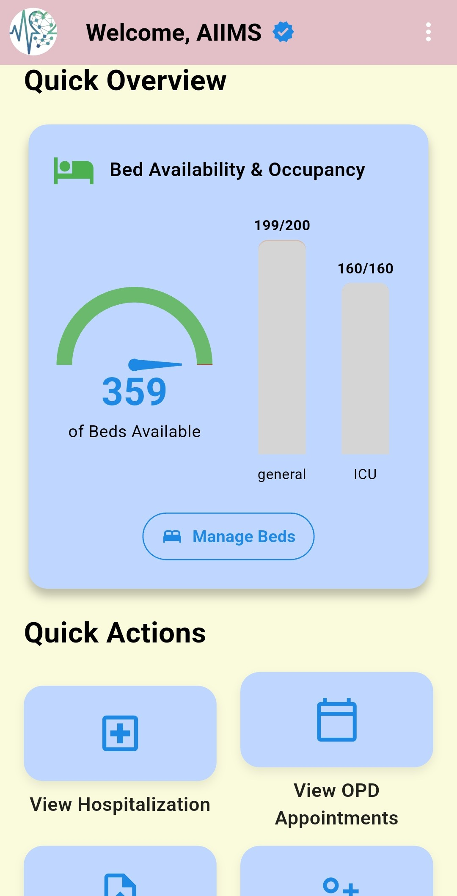
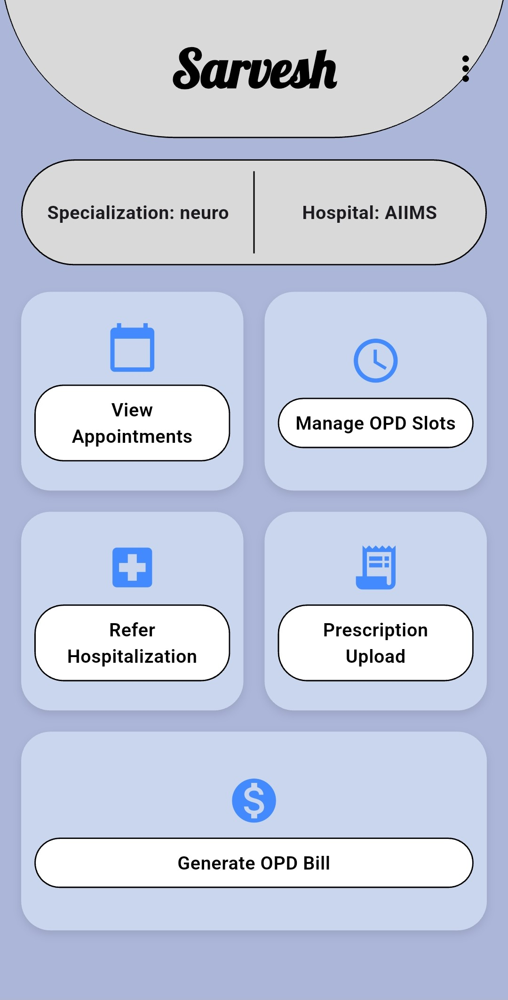

# 🏥 Arogyalink — Smart Online Appointment & Hospital Management System

Arogyalink is a **Flutter + Flask** based healthcare management application that enables **Patients, Hospitals, and Doctors** to interact on a single platform.  
The app simplifies **OPD appointment booking**, **token-based patient queuing**, **hospitalization management**, and **digital prescription & billing** — all with secure **JWT authentication**.

---

## 🚀 Overview

### 🔹 Patient Features
- Register/login and view **verified hospitals** on Google Maps  
- Book **OPD appointments** and get **auto-generated token numbers**  
- View upcoming and completed appointments  
- Manage personal **health records** and profile  
- Receive **prescriptions and bills** via email  
- Pay bills digitally after doctor confirmation  
- Book **hospitalization appointments** if referred by doctor  

### 🔹 Hospital Features
- Register/login and submit **documents for admin verification**  
- Add and manage **doctors** within the hospital system  
- Maintain **ward-wise bed availability**  
- View and manage **patient appointments**  
- Mark appointments as completed  
- Handle **billing and patient records** from dashboard  

### 🔹 Doctor Features
- Login using credentials sent via **encrypted PDF** email  
- Manage OPD **slots (create, update, delete)**  
- View and update daily patient appointments  
- Mark appointments as completed and issue **prescriptions**  
- Refer patients for **hospitalization** when needed  
- Generate **digital bills** and email them directly to patients  

---

## 🔐 Authentication
- Secure **JWT (JSON Web Token)** based authentication system  
- Role-based access for Patients, Hospitals, and Doctors  
- All sensitive data stored in **encrypted format**

---

## ⚙️ Tech Stack

| Component | Technology |
|------------|-------------|
| **Frontend** | Flutter |
| **Backend** | Flask (Python) |
| **Database** | SQLite |
| **Authentication** | JWT Token |
| **APIs** | Google Maps API, SMTP (Email Service) |
| **Cloud/Deployment** | Render / PythonAnywhere (optional) |

---

## 🗂️ Folder Structure
Arogyalink/
│
├── frontend_flutter/
│ ├── lib/
│ ├── assets/
│ ├── pubspec.yaml
│ └── (Flutter code)
│
├── backend_flask/
│ ├── app.py
│ ├── database.sqlite3
│ ├── routes/
│ ├── static/
│ ├── templates/
│ ├── requirements.txt
│ └── (JWT auth, APIs, DB models)
│
├── README.md
└── .gitignore

---

## 🧩 How It Works — App Flow

flowchart TD
A[Patient Registers/Login] --> B[View Hospitals on Map]
B --> C[Book OPD Appointment]
C --> D[Token Generated]
D --> E[Doctor Reviews Appointment]
E --> F[Doctor Marks Complete / Refers for Hospitalization]
F --> G[Hospital Manages Records & Beds]
G --> H[Doctor Sends Prescription & Bill]
H --> I[Patient Receives Mail & Pays Bill]

---

💡 Highlights

✅ 3-role system: Patient, Hospital, Doctor
✅ Real-time OPD token generation
✅ Hospital admin verification before approval
✅ Ward-wise bed management system
✅ Encrypted doctor login credentials (PDF email)
✅ Auto email for prescriptions & billing
✅ Secure JWT-based session management

---

📸 Screenshots

### 1. Splash Screen
  
*The initial splash screen of the app.*

### 2. Patient Dashboard
  
*The patient’s home/dashboard where appointments and health records can be managed.*

### 3. Book OPD Appointment
  
*Patient’s screen for booking OPD appointments with token generation.*

### 4. View Appointment
  
*The screen displaying a list of patient appointments and their status.*

### 5. Pay Bills
  
*The interface for patients to pay their bills.*

### 6. Map View
  
*Map showing registered hospitals and nearby locations for patients.*

### 7. Hospital Admin Dashboard
  
*Dashboard for hospital admins to manage wards, beds, appointments, and doctors.*

### 8. Doctor Dashboard
  
*Doctor’s dashboard to manage OPD slots and mark appointments as completed.*

---

🧠 How to Run the Project Locally
▶️ 1. Backend Setup (Flask)
Navigate to the backend directory:

cd arogyalink-backend
Create and activate a virtual environment.

Install dependencies:

pip install -r requirements.txt
Run the Flask server:

python app.py
# Flask server will typically start at [http://127.0.0.1:5000/](http://127.0.0.1:5000/)

📱 2. Frontend Setup (Flutter)
Navigate to the frontend directory:

cd ../arogyalink
Get Flutter dependencies:

flutter pub get
Run the Flutter app on a connected device/emulator. Ensure the API base URL in your Flutter code points to the running Flask server (e.g., http://10.0.2.2:5000 for Android emulator).

flutter run

---

📦 APK Download
For direct mobile installation, download the compiled APK file from the latest release:

📥 Download Arogyalink App (APK) from GitHub Releases

---

## 👨‍💻 Developer Info

👤 Developer: Sarvesh Dabke  
📧 Email: dabkesarvesh7@gmail.com  

🔗 GitHub: [github.com/sarveshdabke](https://github.com/sarveshdabke)   

---

## 🪪 License

This project is licensed under the MIT License — you are free to use and modify it with proper credit.

---

## 🙏 Credits / Acknowledgements

- UI/UX design created in **Figma** by **Shreya Tripathi** ([GitHub](https://github.com/ShreyaTripathi18),  LinkedIn: [linkedin.com/in/shreya-tripathi-212367331](https://www.linkedin.com/in/shreya-tripathi-212367331))

- Images / screenshots sourced from **Pinterest**  

Thank you to everyone who contributed to making this project better!
